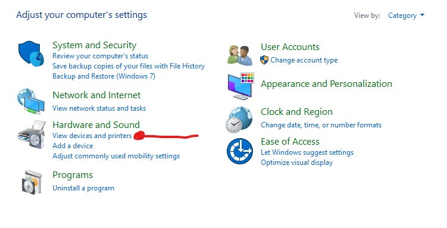
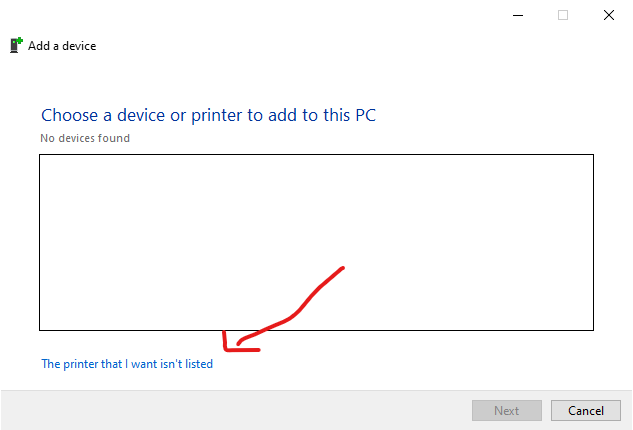
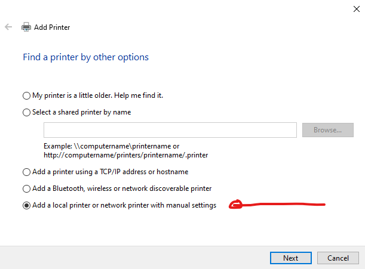
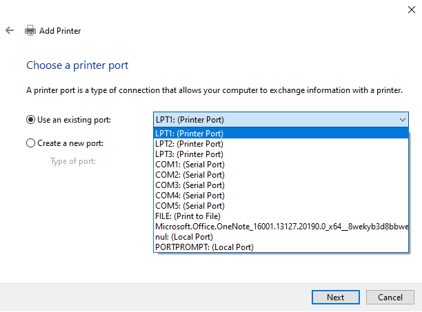
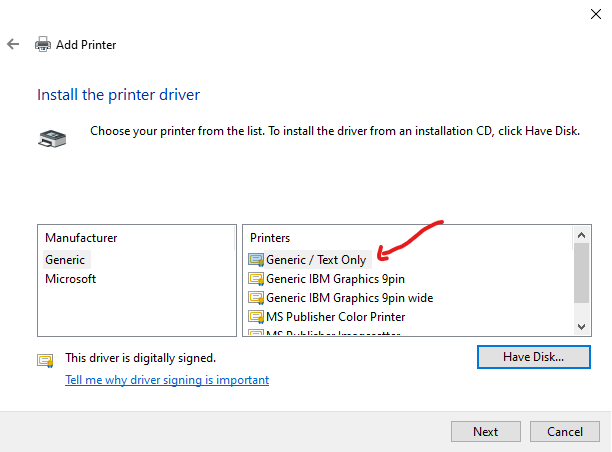
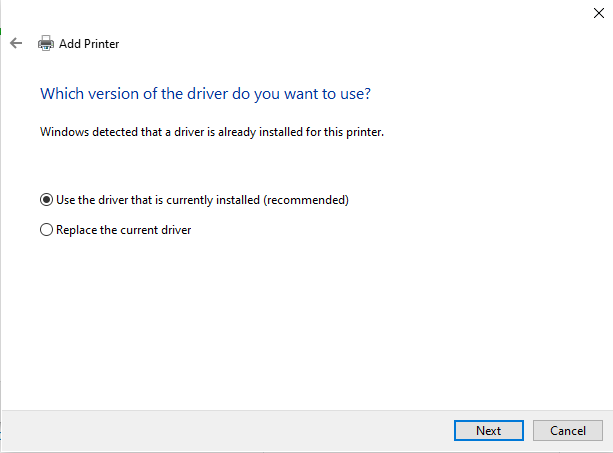
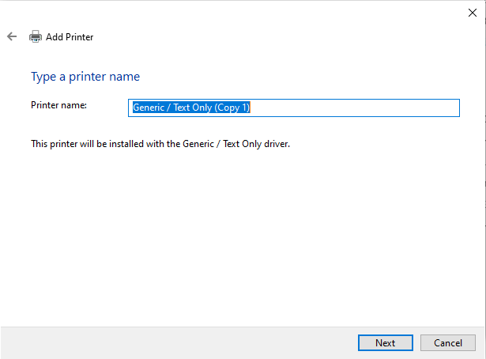
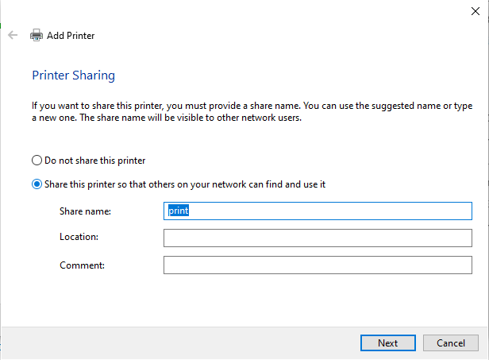
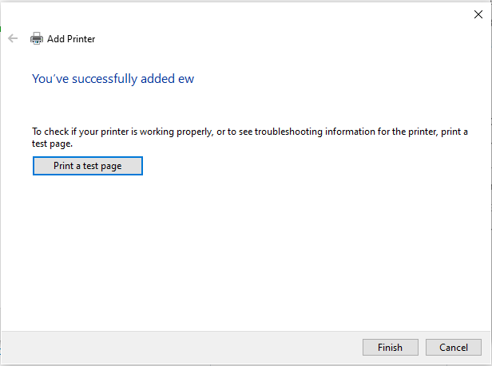

# Thermic Printer

this project aims to print a payment receipt using the mike42 / escpos-php bookstore

[ESC/POS Print Driver for PHP](https://www.markdownguide.org/cheat-sheet/)

## How configure your printer for use this script

if you don´t know how configure your printer fallow this steps:

- connect your print
- open the control panel
  - go to view device and printer
    
  - click in add printer
    
    
  - choice your connection way
    
    
    
  - put name for your printer (remember this name you´ll be use)
    
    
    

so you can try you printer clicking in test.    

## How to use:

After download you need

open the ticket file and change the printer name for the name of your printer 

**If you know how to use the comandes look documentation** [here](https://github.com/mike42/escpos-php)  

